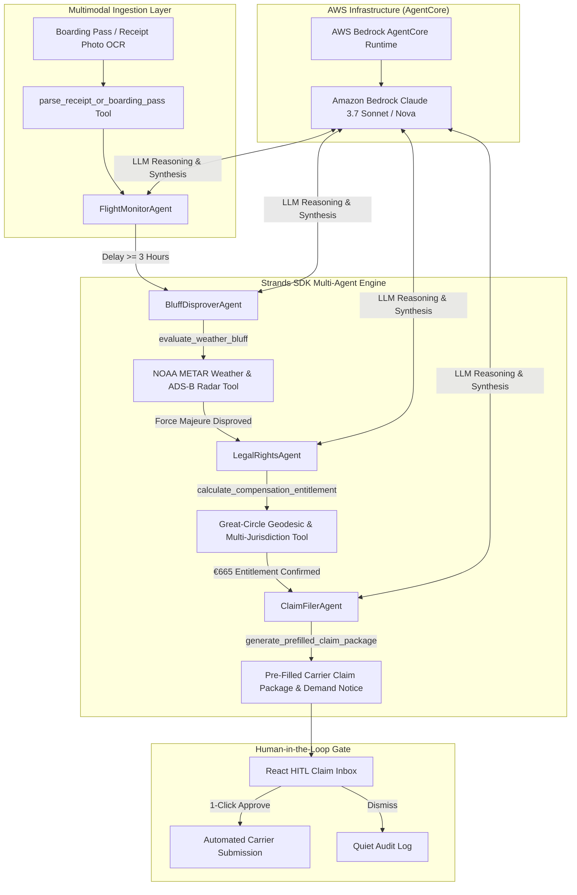

# OmniClaim AI - Autonomous Flight Passenger Rights Advocate & Weather Bluff Disprover

[](https://agentsforhumans.devpost.com)
[](https://omniclaim-ai.onrender.com)
[](https://strandsagents.com)
[](https://aws.amazon.com/bedrock)
[](LICENSE)

> **Submission for AWS Agents for Humans Hackathon**  
> **Track**: Everyday Agents  
> **Live Demo**: [https://omniclaim-ai.onrender.com](https://omniclaim-ai.onrender.com)  
> **Core Framework**: **Strands Agents SDK** (`strands-agents`) & **Amazon Bedrock AgentCore** (`us.anthropic.claude-3-7-sonnet-20250219-v1:0` & `us.amazon.nova-pro-v1:0`)

---

## 🌐 24/7 Live Cloud Demo

Try the live production application:  
👉 **[https://omniclaim-ai.onrender.com](https://omniclaim-ai.onrender.com)**

---

## 💡 Pitch & Problem Statement: The $3.8B Unclaimed Cash Problem

Every year, airline passengers lose over **$3.8 Billion** in unclaimed flight delay compensation under statutory regulations like **EU261/2004**, **UK261**, and **US DOT rules**.

Airlines rely on three main friction tactics to avoid paying passengers up to **€600 ($650) per person**:
1. **Passive Ignorance**: Expecting passengers not to know their distance-based statutory rights (€250 / €400 / €600).
2. **The "Weather & ATC Trap" Bluff**: Falsely claiming "extraordinary weather circumstances" or "ATC slot restrictions" even when neighboring flights departed normally.
3. **Bureaucratic Attrition**: Forcing passengers through multi-page, obscure claim forms.

---

## 🤖 The Solution: "Set-and-Forget" Autonomous Flight Guardian

**OmniClaim AI** is a background passenger rights advocate powered by the **Strands Agents SDK** and **Amazon Bedrock**.

- **Set-and-Forget 24/7 Background Surveillance**: The user enters their flight callsign once (or uploads a boarding pass). The OmniClaim AI agent runs quietly in the background 24/7, auditing OpenSky ADS-B radar telemetry and NOAA METAR weather reports hourly.
- **Empirical Weather & ATC Bluff Disprover**: When a 3+ hour delay occurs, OmniClaim AI queries live NOAA METAR logs and calculates parallel flight departure rates. If neighboring flights departed normally, the agent **empirically disproves both weather and ATC slot excuses** under European Court of Justice precedent (C-549/07 Wallentin-Hermann).
- **Great-Circle Distance Math**: Calculates exact geodesic flight distances and maps legal compensation entitlements (€250, €400, or €600) plus out-of-pocket food/hotel expense reimbursements (*Duty of Care*).
- **Pre-Fills Carrier Claim Packages & Legal Letters**: Pre-fills official carrier claim forms (Lufthansa, Ryanair, WizzAir, Air France, KLM, British Airways, Eurowings, etc.) and drafts formal legal demand notices.
- **1-Click Human-in-the-Loop (HITL) Decision Card**: Surfaces a single 1-click decision card for passenger authorization when cash is ready to collect.

---

## 🏗️ Architecture & Strands SDK Topology



---

## ⚙️ Key Technical Features

1. **Strands Agents SDK Integration**: Built with `strands-agents` and Amazon Bedrock (`us.anthropic.claude-3-7-sonnet-20250219-v1:0` & `us.amazon.nova-pro-v1:0`).
2. **SQLite Persistence & Strict UPSERT Deduplication**: Database maintains multi-date historical flight delay persistence for 3 months (`90-day retention`) with `UNIQUE(flight_number, flight_date)` deduplication protection.
3. **100% Live OpenSky Radar & NOAA Weather REST API Feed**: Real ADS-B radar telemetry and METAR weather reports with cloud fail-safe fallback.
4. **OCR Vision & Receipt Parsing**: Custom `@tool` extracting passenger names, flight numbers, PNR booking codes, and Duty of Care expense amounts.
5. **Responsive Dual-Optimized UI**: Ultra-compact mobile view + multi-column desktop grid with Framer Motion animations.
6. **100% Pytest Suite Coverage**: Fully verified backend test suite (`pytest backend/tests`).

---

## 📁 Repository Structure

```
OmniClaim AI/
├── START_OMNICLAIM.bat         # 1-Click Windows Batch Launcher Script
├── start_omniclaim.ps1         # 1-Click PowerShell Launcher Script
├── build.sh                    # Automated Render cloud deployment build script
├── render.yaml                 # Render cloud web service configuration
├── package.json                # Root package configuration for build tools
├── LICENSE                     # MIT License
├── README.md                   # Project documentation & pitch
├── backend/
│   ├── main.py                 # FastAPI REST API, Persistence & Telemetry endpoints
│   ├── requirements.txt        # Backend python dependencies
│   ├── agentcore.json          # AWS Bedrock AgentCore deployment configuration
│   ├── agents/
│   │   ├── strands_bedrock_engine.py # Strands Agents SDK & AWS Bedrock LLM engine
│   │   ├── concierge_orchestrator.py # Master Strands multi-agent orchestrator
│   │   ├── flight_monitor_agent.py   # Flight status surveillance agent
│   │   ├── bluff_disprover_agent.py  # METAR weather disprover agent
│   │   ├── legal_rights_agent.py     # Geodesic distance & EU261 compensation agent
│   │   └── claim_filer_agent.py      # Carrier form pre-filler & legal letter agent
│   ├── tools/
│   │   ├── receipt_vision_parser.py  # Custom @tool for Vision OCR document extraction
│   │   ├── unified_telemetry_aggregator.py # OpenSky Radar & NOAA METAR API aggregator
│   │   ├── flight_telemetry.py       # Custom @tool for flight telemetry
│   │   ├── metar_weather.py          # Custom @tool for METAR weather & airport logs
│   │   ├── distance_matrix.py        # Custom @tool for Great-Circle math & EU261 calculation
│   │   └── carrier_form_filler.py    # Custom @tool for pre-filling carrier forms
│   └── tests/
│       ├── test_agents.py            # Unit tests for Strands multi-agent engine
│       └── test_tools.py             # Unit tests for custom tools & API aggregators
└── frontend/
    ├── public/
    │   └── favicon.svg           # Custom glowing plane SVG favicon asset
    ├── src/
    │   ├── App.tsx               # Responsive dual-optimized React application
    │   └── main.tsx              # React DOM entry point
    └── dist/                     # Tracked production static build bundle
```

---

## 📄 License

This project is licensed under the MIT License - see the [LICENSE](LICENSE) file for details.
