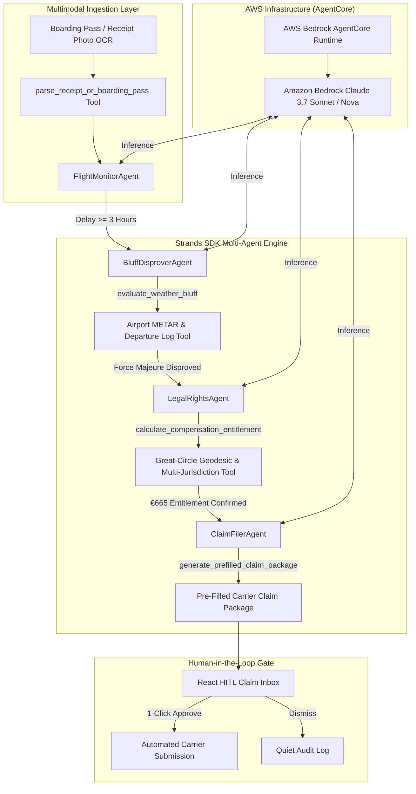

# OmniClaim AI - Autonomous Flight Passenger Rights Advocate & Weather Bluff Disprover

[](https://agentsforhumans.devpost.com)
[](https://strandsagents.com)
[](https://aws.amazon.com/bedrock)
[](LICENSE)

> **Submission for AWS Agents for Humans Hackathon**  
> **Track**: Everyday Agents  
> **Core Framework**: **Strands Agents SDK** (`strands-agents`) & **AWS Bedrock AgentCore**

---

## 🚀 1-Click Fast Launcher (Windows)

Simply double-click **`START_OMNICLAIM.bat`** in the project folder!  
It automatically starts both the Python Backend and Vite Frontend servers, and opens `http://localhost:5173` in your browser.

---

## 💡 Pitch & Problem Statement

Every year, airline passengers lose over **$3.8 Billion** in unclaimed flight delay and cancellation compensation under regulations like **EU261/2004**, **UK261**, and **US DOT rules**.

Airlines rely on three main friction tactics:
1. **Passive Ignorance**: Expecting passengers not to know their rights or distance-based entitlement tiers (€250 / €400 / €600).
2. **The "Weather Trap" Bluff**: Claiming "extraordinary circumstances" (bad weather or ATC restriction) even when neighboring flights took off normally.
3. **Bureaucratic Attrition**: Forcing passengers through multi-page, obscure claim forms.

### The Solution: OmniClaim AI
**OmniClaim AI** is an autonomous background passenger rights advocate built with the **Strands Agents SDK**.
1. **Multimodal Vision OCR Document Ingestion**: Upload photo/PDF of boarding passes or airport meal/hotel expense receipts.
2. **Disproves Airline Weather Bluffs**: Fetches official airport METAR meteorological observations and parallel flight departure rates to empirically disprove false "force majeure" claims by airlines.
3. **Great-Circle Distance Math**: Calculates exact geodesic flight distances and maps legal compensation entitlements (€250, €400, or €600) + out-of-pocket Duty of Care expense reimbursements.
4. **Pre-Fills Carrier Claim Packages**: Pre-fills official carrier claim forms (Lufthansa, Ryanair, WizzAir, etc.) and drafts formal legal demand notices.
5. **1-Click Human-in-the-Loop (HITL) Gate**: Surfaces a clean decision card for 1-click passenger authorization.

---

## 🏗️ Architecture & Strands SDK Topology



---

## 📁 Repository Structure

```
Agents for Humans Hackathon/
├── START_OMNICLAIM.bat         # 1-Click Windows Batch Launcher Script
├── start_omniclaim.ps1         # 1-Click PowerShell Launcher Script
├── LICENSE                     # MIT License
├── README.md                   # Project documentation & pitch
├── backend/
│   ├── main.py                 # FastAPI REST API, Vision OCR & Telemetry endpoints
│   ├── requirements.txt        # Backend python dependencies
│   ├── agentcore.json          # AWS Bedrock AgentCore deployment configuration
│   ├── agents/
│   │   ├── concierge_orchestrator.py # Master Strands multi-agent orchestrator
│   │   ├── flight_monitor_agent.py   # Flight status surveillance agent
│   │   ├── bluff_disprover_agent.py  # METAR weather disprover agent
│   │   ├── legal_rights_agent.py     # Geodesic distance & EU261 compensation agent
│   │   └── claim_filer_agent.py      # Carrier form pre-filler & legal letter agent
│   ├── tools/
│   │   ├── receipt_vision_parser.py  # Custom @tool for Vision OCR document extraction
│   │   ├── flight_telemetry.py       # Custom @tool for flight telemetry
│   │   ├── metar_weather.py          # Custom @tool for METAR weather & airport logs
│   │   ├── distance_matrix.py        # Custom @tool for Great-Circle math & EU261 calculation
│   │   └── carrier_form_filler.py    # Custom @tool for pre-filling carrier forms
│   └── tests/
│       ├── test_agents.py            # Pytest suite for multi-agent workflows
│       └── test_tools.py             # Pytest suite for Vision OCR, METAR bluff & legal math
├── frontend/
│   ├── package.json
│   ├── vite.config.ts
│   └── src/
│       ├── App.tsx                    # OmniClaim Interactive Control Center
│       └── types/
│           └── index.ts
└── docs/
    └── BUILDER_POST_TEMPLATE.md       # Pre-written article for builder.aws.com
```

---

## ⚡ Manual Quickstart Guide

### 1. Running Backend Unit Tests & Server
```bash
# Navigate to project root
cd "Agents for Humans Hackathon"

# Run automated test suite
python -m pytest backend/tests

# Start FastAPI server
python -m uvicorn backend.main:app --host 127.0.0.1 --port 8000
```

### 2. Building & Running the Frontend
```bash
# Navigate to frontend directory
cd frontend

# Install node dependencies
npm install

# Build production bundle
npm run build

# Start dev server
npm run dev
```

---

## 🧪 Verification & Test Results

```bash
============================= test session starts =============================
platform win32 -- Python 3.12.10, pytest-9.1.1, pluggy-1.6.0
collected 8 items

backend/tests/test_agents.py ..                                          [ 25%]
backend/tests/test_tools.py ......                                       [100%]

============================== 8 passed in 0.63s ==============================
```

---

## 📄 License

This project is licensed under the [MIT License](LICENSE).
