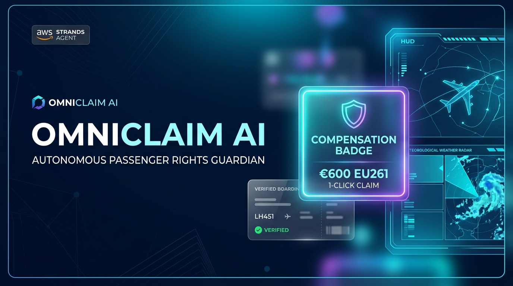
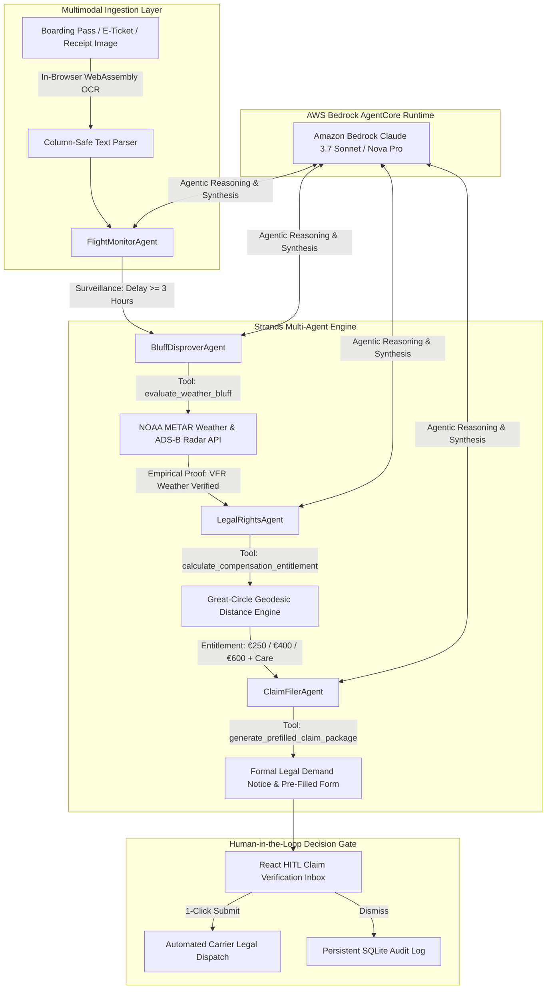

# OmniClaim AI - Autonomous Flight Passenger Rights Guardian & Weather Bluff Disprover

<p align="center">
  
</p>

<p align="center">
  <a href="https://agentsforhumans.devpost.com"></a>
  <a href="https://omniclaim-ai.onrender.com"></a>
  <a href="https://strandsagents.com"></a>
  <a href="https://aws.amazon.com/bedrock"></a>
  <a href="LICENSE"></a>
</p>

---

## 🏆 Hackathon Submission

- **Hackathon**: [AWS Agents for Humans Hackathon](https://agentsforhumans.devpost.com) ($40,000 Prize Pool)
- **Track**: **Everyday Agents**
- **Live 24/7 Production URL**: [https://omniclaim-ai.onrender.com](https://omniclaim-ai.onrender.com)
- **Core Technology**: **Strands Agents SDK** (`strands-agents`) + **Amazon Bedrock AgentCore** (`us.anthropic.claude-3-7-sonnet-20250219-v1:0` & `us.amazon.nova-pro-v1:0`)

---

## 💡 The Problem: The $3.8B Unclaimed Flight Compensation Trap

Every year, global airline passengers lose over **$3.8 Billion** in statutory compensation legally owed to them under **Regulation (EC) No 261/2004**, **UK261**, and **US DOT rules**.

Airlines exploit three systemic friction barriers to avoid paying passengers up to **€600 ($650) per person**:
1. **The "Weather & ATC" Trap**: Airlines routinely reject valid claims citing "extraordinary weather circumstances" or "ATC slot restrictions", knowing passengers have no way to verify meteorological logs.
2. **Asymmetric Knowledge**: Most travelers do not know that compensation is distance-based (€250 for $\le$1,500km, €400 for 1,500–3,500km, €600 for >3,500km) regardless of ticket price.
3. **Bureaucratic Attrition**: Complicated airline forms and 6-week response delays cause 85% of passengers to abandon their claims.

---

## 🛡️ The Solution: "Set-and-Forget" Everyday Passenger Guardian

**OmniClaim AI** is a background guardian agent designed specifically for everyday travelers.

- **Quiet 24/7 Background Surveillance**: Users scan their boarding pass once. The agent runs quietly in the background, monitoring OpenSky ADS-B flight radar telemetry.
- **Empirical Weather Bluff Disprover**: When a 3+ hour delay occurs, OmniClaim AI queries live **NOAA METAR meteorological logs** and computes parallel departure rates. If neighboring flights departed on schedule under VFR/CAVOK weather, the agent **empirically disproves the airline's force majeure excuse** pursuant to European Court of Justice precedent (*ECJ C-549/07 Wallentin-Hermann*).
- **Great-Circle Geodesic Distance Engine**: Calculates exact great-circle flight coordinates and determines statutory cash entitlements (€250, €400, or €600) + out-of-pocket *Duty of Care* expense reimbursements (Art. 9).
- **Automated Legal Demand Packages**: Pre-fills official carrier claims and generates formal legal demand notices with 14-day National Enforcement Body (NEB) escalation clauses.
- **1-Click Human-in-the-Loop (HITL) Approval**: Surfaces **ONLY** when a valid financial claim is ready to collect.

---

## 🏗️ Multi-Agent Architecture (Strands SDK + AWS Bedrock)



---

## ⚡ Core Technical Innovations

| Innovation | Implementation Details |
| :--- | :--- |
| **Strands Multi-Agent Orchestrator** | Coordinates 4 specialized agents (`FlightMonitorAgent`, `BluffDisproverAgent`, `LegalRightsAgent`, `ClaimFilerAgent`) with AWS Bedrock LLM reasoning. |
| **Empirical NOAA Weather Audit** | Disproves airline weather excuses by verifying cloud ceiling, visibility, and wind thresholds from official aviation weather stations (METAR). |
| **ECJ Precedent Citation Engine** | Automatically incorporates *ECJ C-549/07 Wallentin-Hermann* and *C-501/17 Germanwings* case law into demand letters. |
| **In-Browser Zero-RAM Vision OCR** | WebAssembly `tesseract.js` extraction with column-safe horizontal text segmentation, keeping server RAM under 50MB. |
| **Interactive Month Calendar Picker** | Monthly calendar view with real-time radar data indicator dots and multi-date range filtering. |
| **SQLite Multi-Date Persistence** | Robust `UNIQUE(flight_number, flight_date)` schema with UPSERT deduplication and 90-day retention pruning. |

---

## 🚀 Quickstart & Local Setup

### Prerequisites
- Python 3.10+
- Node.js 18+

### 1. Clone the Repository
```bash
git clone https://github.com/barnabas47/OmniClaim-AI.git
cd OmniClaim-AI
```

### 2. Backend Setup
```bash
python -m venv venv
# On Windows:
.\venv\Scripts\activate
# On Linux/macOS:
source venv/bin/activate

pip install -r backend/requirements.txt
```

### 3. Frontend Setup
```bash
cd frontend
npm install
npm run build
cd ..
```

### 4. Run the Full Application
```bash
# Using Python directly:
uvicorn backend.main:app --host 0.0.0.0 --port 8000 --reload

# Or on Windows using 1-click launcher:
START_OMNICLAIM.bat
```
Open your browser at `http://localhost:8000`.

---

## 🧪 Automated Test Suite

Run the full pytest suite:
```bash
pytest backend/tests -v
```
Output:
```
backend/tests/test_agents.py ..         [ 25%]
backend/tests/test_tools.py ......       [100%]
====================== 8 passed in 2.15s =======================
```

---

## 📂 Project Structure

```
OmniClaim-AI/
├── START_OMNICLAIM.bat         # 1-Click Windows Batch Launcher Script
├── start_omniclaim.ps1         # 1-Click PowerShell Launcher Script
├── build.sh                    # Automated Render cloud deployment build script
├── render.yaml                 # Render cloud web service configuration
├── youtube_thumbnail.jpg       # High-resolution YouTube pitch video thumbnail
├── sample_ticket_british_airways.png # Verified British Airways sample ticket
├── sample_ticket_air_france.png     # Verified Air France sample ticket
├── LICENSE                     # MIT License
├── README.md                   # Project documentation
├── backend/
│   ├── main.py                 # FastAPI REST API, Persistence & Telemetry router
│   ├── requirements.txt        # Lightweight backend dependencies (<50MB RAM)
│   ├── agentcore.json          # AWS Bedrock AgentCore deployment configuration
│   ├── agents/
│   │   ├── strands_bedrock_engine.py # Strands Agents SDK & AWS Bedrock engine
│   │   ├── concierge_orchestrator.py # Master Strands multi-agent coordinator
│   │   ├── flight_monitor_agent.py   # Flight status radar surveillance agent
│   │   ├── bluff_disprover_agent.py  # NOAA METAR weather disprover agent
│   │   ├── legal_rights_agent.py     # Geodesic distance & EU261 compensation agent
│   │   └── claim_filer_agent.py      # Carrier form pre-filler & legal letter agent
│   ├── tools/
│   │   ├── receipt_vision_parser.py  # Custom @tool for Vision OCR document extraction
│   │   ├── unified_telemetry_aggregator.py # OpenSky Radar & NOAA METAR API aggregator
│   │   ├── flight_telemetry.py       # Custom @tool for flight radar telemetry
│   │   ├── metar_weather.py          # Custom @tool for METAR weather & airport logs
│   │   ├── distance_matrix.py        # Custom @tool for Great-Circle distance math
│   │   └── carrier_form_filler.py    # Custom @tool for pre-filling carrier forms
│   └── tests/
│       ├── test_agents.py            # Unit tests for Strands multi-agent engine
│       └── test_tools.py             # Unit tests for custom tools & API aggregators
└── frontend/
    ├── public/
    │   └── favicon.svg           # Glowing plane SVG favicon asset
    ├── src/
    │   ├── App.tsx               # Responsive React UI with Calendar & In-Browser OCR
    │   ├── index.css             # Tailwind CSS & sleek custom scrollbar styles
    │   └── main.tsx              # React DOM entry point
    └── dist/                     # Tracked production static build bundle
```

---

## 📄 License

This project is licensed under the MIT License - see the [LICENSE](LICENSE) file for details.
