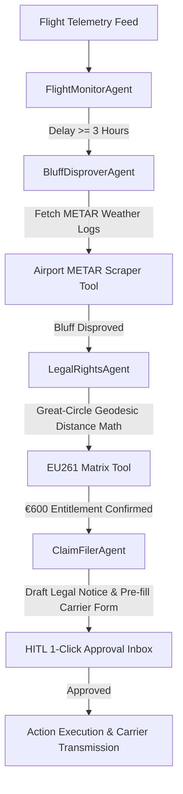

# OmniClaim AI: How We Built an Autonomous Flight Passenger Rights Advocate with Strands Agents SDK on AWS

**Published for AWS Agents for Humans Hackathon**  
**Track**: Everyday Agents  
**Authors**: OmniClaim AI Team

---

## 1. The Problem: $3.8 Billion in Unclaimed Flight Compensation

Every year, millions of airline passengers suffer flight delays of 3, 4, or 5+ hours. Under international regulations like **EU261/2004**, **UK261**, and **US DOT rules**, passengers are legally entitled to **€250, €400, or €600** in statutory cash compensation per ticket.

However, airlines rely on three main friction tactics:
1. **Passive Ignorance**: Expecting passengers not to know their rights or distance-based entitlement tiers.
2. **The "Weather Trap" Bluff**: Claiming "extraordinary circumstances" (bad weather or air traffic control) even when neighboring flights took off normally.
3. **Bureaucratic Attrition**: Forcing passengers through multi-page, obscure claim forms.

We built **OmniClaim AI** to change the balance of power—an autonomous background AI agent that monitors flights, empirically disproves airline force majeure excuses using METAR weather logs, pre-fills claim forms, and surfaces a 1-click decision card to the passenger.

---

## 2. Solution: OmniClaim AI Powered by Strands Agents SDK

Built on the **Strands Agents SDK** (`strands-agents`) and designed for execution on **Amazon Bedrock AgentCore**, OmniClaim AI operates in the background:

### How It Works End-to-End:

1. **Background Flight Surveillance**:  
   `FlightMonitorAgent` checks departure/arrival timestamps and flags flight delays exceeding the 3-hour statutory threshold.

2. **Empirical METAR Weather Bluff Disprover**:  
   `BluffDisproverAgent` fetches official airport METAR meteorological observations at departure/arrival timestamps and logs parallel flight departure success rates. If clear weather (VFR) and high departure rates are recorded, it disproves false extraordinary circumstance claims.

3. **Geodesic Distance & Legal Entitlement Engine**:  
   `LegalRightsAgent` calculates Great-Circle distance between airport ICAO coordinates and assigns statutory compensation (€250, €400, or €600).

4. **Pre-Filled Carrier Claim Package**:  
   `ClaimFilerAgent` pre-fills official carrier claim forms (Lufthansa, Ryanair, WizzAir, British Airways) and drafts formal legal demand letters citing EU261 regulations.

5. **Human-in-the-Loop (HITL) 1-Click Approval Gate**:  
   Surfaces a clean decision card: *"Flight LH401 was delayed 4h 15m. Lufthansa claimed severe weather, but METAR weather logs prove clear skies and 15/16 parallel flights departed normally. You are entitled to €600. Pre-filled claim form & legal letter attached. Approve submission?"*

---

## 3. Technical Architecture

### Key AWS Technologies Used:
- **Strands Agents SDK**: Framework for multi-agent orchestration, custom `@tool` decorators, and OpenTelemetry logging hooks.
- **Amazon Bedrock**: Model inference using Claude 3.7 Sonnet (`us.anthropic.claude-3-7-sonnet-20250219-v1:0`) and Amazon Nova Pro fallback.
- **Amazon Bedrock AgentCore**: Production serverless runtime environment for autonomous background execution.

---

## 4. Key Takeaways & What's Next

By combining model-driven reasoning with empirical data verification (METAR weather logs + Great-Circle geodesic distance math), OmniClaim AI gives passengers their money back with zero administrative effort.

*Check out our full open-source codebase on GitHub!*
